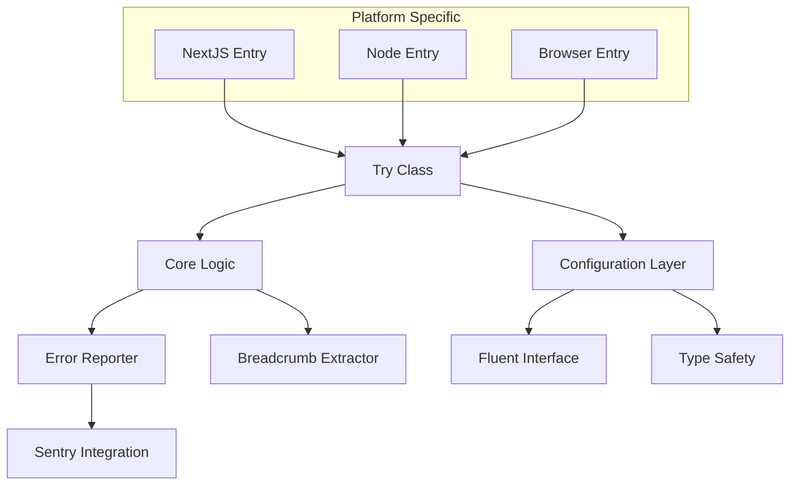
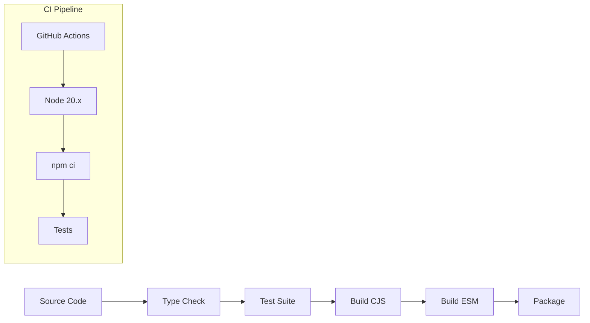

# Production Readiness Audit - @power-rent/try-catch

## Overview

This document provides a comprehensive production readiness assessment for the `@power-rent/try-catch` TypeScript utility library. The library simplifies async error handling with integrated Sentry error reporting through a fluent interface pattern.

**Library Type**: TypeScript Utility Library  
**Version**: 0.0.7  
**License**: ISC  
**Target Environments**: Node.js ≥18, Browser, Next.js  

## Architecture Assessment

### Current Architecture Strengths



**Architectural Patterns Used:**
- **Adapter Pattern**: Platform-specific Sentry integrations
- **Builder Pattern**: Fluent interface for method chaining
- **Strategy Pattern**: Different error handling approaches
- **Decorator Pattern**: Adding metadata to errors

### Architecture Strengths
- Clean separation of concerns between core logic and Sentry integration
- Immutable configuration through builder pattern
- Type-safe API with comprehensive TypeScript support
- Modular design with platform-specific entry points

### Architecture Concerns
- **Tight Coupling**: Core implementation still has direct Sentry dependencies
- **Global State**: Static error type configuration affects all instances
- **Side Effects**: Breadcrumbs can mutate global Sentry scope
- **Mixed Responsibilities**: Single class handles execution, configuration, and reporting

## Test Coverage Analysis

### Current Test Suite

| Test File | Lines | Focus Area | Coverage Quality |
|-----------|-------|------------|------------------|
| `Try.test.ts` | 799 | Core functionality, error handling, configuration | ★★★★☆ |
| `flexible-breadcrumbs.test.ts` | 316 | Breadcrumb extraction, parameter transformers | ★★★★☆ |

### Test Coverage Strengths
- **Comprehensive API Coverage**: All major methods and configurations tested
- **Error Scenarios**: Various error conditions and edge cases covered
- **Mocking Strategy**: Proper Sentry SDK mocking prevents external dependencies
- **Parameter Variations**: Different parameter types and configurations tested
- **Asynchronous Handling**: Both sync and async operations covered

### Test Coverage Gaps

#### Missing Test Categories
- **Performance Testing**: No benchmarks for overhead measurements
- **Memory Leak Testing**: No tests for cached result cleanup
- **Concurrency Testing**: No parallel execution stress tests
- **Integration Testing**: No real Sentry integration tests
- **Edge Case Coverage**: Missing boundary condition tests

#### Recommended Additional Tests
```typescript
describe('Performance & Reliability', () => {
  it('should not leak memory with cached results')
  it('should handle high-frequency error scenarios')
  it('should maintain performance under concurrent usage')
})

describe('Integration Tests', () => {
  it('should work with real Sentry configuration')
  it('should handle Sentry SDK failures gracefully')
})
```

## Developer Experience (DX) Audit

### DX Strengths
- **Intuitive API**: English-like fluent interface
- **Comprehensive Documentation**: Detailed README with examples
- **TypeScript Integration**: Full type safety and intellisense
- **Flexible Parameter Handling**: Supports various parameter types
- **Rich Examples**: Multiple usage patterns documented

### DX Pain Points & Improvements

#### Critical Issues

1. **Broken Base Entry Point**
   ```typescript
   // Currently broken - exports nothing
   import Try from '@power-rent/try-catch'; // ❌ No API available
   
   // Workaround required
   import Try from '@power-rent/try-catch/nextjs'; // ✅ Works
   ```

2. **Version Mismatch**
   - README claims Node ≥20
   - package.json specifies ">=18"
   - Recommendation: Align to Node ≥20

3. **Thenable Behavior Surprise**
   ```typescript
   // Surprising behavior - never throws
   const result = await new Try(riskyFn); // Returns undefined on error
   
   // Expected behavior for throwing
   const result = await new Try(riskyFn).unwrap(); // Throws on error
   ```

#### Architecture Improvements Needed

4. **Global State Pollution**
   ```typescript
   // Global static affects all instances
   Try.throwThroughErrorTypes(['ValidationError']); // ❌ Global side effect
   
   // Per-instance configuration needed
   new Try(fn).throwThrough(['ValidationError']); // ✅ Proposed
   ```

5. **Sentry Scope Pollution**
   ```typescript
   // Breadcrumbs pollute global scope
   new Try(fn).breadcrumbs(['key']).value(); // ❌ Mutates global Sentry scope
   ```

6. **Hard-coded Sentry Dependency**
   ```typescript
   // Core tied to specific Sentry SDK
   import * as Sentry from '@sentry/nextjs'; // ❌ Environment-specific
   ```

### DX Enhancement Recommendations

#### High Priority
1. **Fix Base Entry Point**
   ```typescript
   // src/index.ts - export working API
   export { Try as default, Try, TryResult } from './nextjs/index.js';
   ```

2. **Add Factory Function**
   ```typescript
   export const attempt = <T, TArgs extends readonly unknown[]>(
     fn: (...args: TArgs) => T | Promise<T>,
     ...args: TArgs
   ) => new Try(fn, ...args);
   ```

3. **Document Thenable Behavior**
   - Add prominent warning about `await new Try(fn)` behavior
   - Recommend explicit `.value()` or `.unwrap()` usage

#### Medium Priority
4. **Per-instance Configuration**
5. **Sentry Scope Management**
6. **Environment-specific Adapters**

## Production Readiness Assessment

### Security Analysis

| Category | Status | Notes |
|----------|--------|-------|
| Dependency Security | ★★★★☆ | No direct security vulnerabilities, peer dependencies well-managed |
| Error Information Leakage | ★★★☆☆ | Error wrapping could expose sensitive stack traces |
| Input Validation | ★★★★★ | Type-safe API prevents most injection issues |
| Secret Handling | ★★★★☆ | No direct secret handling, relies on Sentry configuration |

#### Security Recommendations
- **Error Sanitization**: Add option to sanitize error messages
- **Stack Trace Control**: Option to exclude stack traces from reports
- **Breadcrumb Filtering**: Prevent sensitive data in breadcrumbs

### Performance Analysis

| Metric | Assessment | Impact |
|--------|------------|--------|
| Memory Usage | ★★★☆☆ | Cached results may accumulate |
| CPU Overhead | ★★★★☆ | Minimal wrapping overhead |
| Bundle Size | ★★★★☆ | Lightweight core, peer dependencies |
| Cold Start Impact | ★★★★☆ | Fast initialization |

#### Performance Concerns
- **Memory Leaks**: Cached results not cleared
- **Sentry Integration Overhead**: Synchronous breadcrumb operations
- **Type Inference**: Complex generics may slow TypeScript compilation

### Reliability Assessment

| Category | Rating | Issues |
|----------|--------|--------|
| Error Handling | ★★★★☆ | Comprehensive error scenarios covered |
| Resource Management | ★★★☆☆ | No cleanup mechanisms for cached data |
| Concurrency Safety | ★★★☆☆ | Static state can cause race conditions |
| Backward Compatibility | ★★★★★ | Strong semantic versioning practices |

## Build & CI/CD Analysis

### Current Build Pipeline



### Build Strengths
- **Dual Module Support**: Both CommonJS and ESM builds
- **TypeScript Integration**: Full declaration file generation
- **Automated Testing**: CI runs on every PR
- **Release Automation**: Changesets for version management

### Build Weaknesses
- **No Coverage Reporting**: Missing test coverage metrics
- **No Performance Benchmarks**: No performance regression detection
- **Limited Platform Testing**: Only Ubuntu in CI
- **No Bundle Analysis**: No size impact tracking

### Missing Production Checklist

#### Code Quality Gates
- [ ] Test coverage thresholds (recommend 90%+)
- [ ] Performance benchmarks
- [ ] Bundle size limits
- [ ] Dependency vulnerability scanning
- [ ] License compliance checking

#### Release Process
- [ ] Security scanning in CI
- [ ] Cross-platform testing (Windows, macOS)
- [ ] Node.js version matrix testing
- [ ] Breaking change detection
- [ ] Documentation deployment

## Critical Issues for Production

### Severity: HIGH
1. **Broken Base Entry Point** - Library unusable without environment-specific imports
2. **Global State Management** - Thread safety and test isolation issues
3. **Memory Management** - Potential memory leaks from cached results

### Severity: MEDIUM  
4. **Sentry Scope Pollution** - Side effects affecting other library users
5. **Hard-coded Dependencies** - Limits environment flexibility
6. **Version Misalignment** - Documentation vs. implementation mismatch

### Severity: LOW
7. **Missing Coverage Metrics** - Blind spots in test quality
8. **Performance Monitoring** - No regression detection
9. **Documentation Gaps** - Thenable behavior not clearly documented

## Recommendations

### Immediate Actions (Pre-Production)

1. **Fix Entry Point**
   ```json
   // package.json exports
   ".": {
     "types": "./dist/index.d.ts",
     "require": "./dist/index.js", 
     "import": "./dist/esm/index.js"
   }
   ```

2. **Add Coverage Reporting**
   ```yaml
   # .github/workflows/ci.yml
   - name: Run tests with coverage
     run: npm run test -- --coverage
   - name: Upload coverage
     uses: codecov/codecov-action@v3
   ```

3. **Implement Memory Cleanup**
   ```typescript
   // Add to Try class
   private cleanup(): void {
     this.cachedResult = undefined;
     this.cachedBreadcrumbData = undefined;
   }
   ```

### Short-term Improvements (1-2 sprints)

4. **Decouple Sentry Integration**
   - Implement adapter pattern for reporters
   - Create environment-specific entry points
   - Add NoopReporter for testing

5. **Add Per-instance Configuration**
   - Remove global static state
   - Support instance-level error type configuration

6. **Enhance Test Suite**
   - Add integration tests
   - Performance benchmarks
   - Memory leak detection

### Long-term Architecture (3-6 months)

7. **Scope Management**
   - Use Sentry.withScope for isolation
   - Prevent breadcrumb pollution

8. **Enhanced DX**
   - Factory functions
   - Functional programming helpers (.map, .match)
   - Better TypeScript inference

9. **Production Monitoring**
   - Performance metrics collection
   - Error rate monitoring
   - Usage analytics