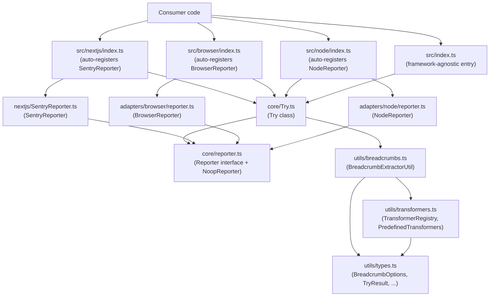

<!-- generated-by: gsd-doc-writer -->
# Architecture

## System overview

`@power-rent/try-catch` is a TypeScript library that wraps synchronous and asynchronous functions in a fluent builder API, converting throw-based control flow into typed result values. A caller constructs a `Try` instance around any function, optionally configures error context (message, tags, breadcrumbs), and then resolves the operation through one of four terminal methods: `unwrap`, `value`, `result`, or `error`. The library is runtime-agnostic at its core; Sentry error reporting is layered on via adapter modules that are imported per deployment environment (Node.js, browser, Next.js).

## Component diagram



## Data flow

A typical call proceeds as follows:

1. **Construction** — `new Try(fn, ...args)` stores the function and its arguments. If `fn` is an `AsyncFunction`, a thenable `.then` property is installed immediately so the instance can be directly `await`-ed. For non-async functions no `.then` is installed, so the instance is not thenable and any thenability probe (e.g. `Promise.resolve`, `util.inspect`, deep-equality matchers) cannot trigger execution.
2. **Configuration** — The caller chains `.report(message)`, `.breadcrumbs(config)`, `.tag(name, value)`, `.tags({...})`, `.default(fallback)`, `.debug()`, and/or `.finally(callback)`. Each method mutates internal config and returns `this`.
3. **Execution** — A terminal method (`unwrap`, `value`, `result`, or `error`) calls the private `execute()` method. `execute()` invokes `fn(...args)` inside a `try/catch`. If the return value is thenable, execution continues asynchronously via `Promise.resolve(value).then(...).catch(...).finally(...)`. Otherwise it settles synchronously. Results are cached so repeated terminal calls do not re-invoke the function.
4. **Thrown-value normalization** — Both the synchronous `catch (e)` arm of `execute()` and the async `.catch(...)` branch pass the thrown value through `Try.normalizeThrown`. If `e instanceof Error`, it is returned unchanged. Otherwise a fresh `Error` is constructed with `message === 'Non-Error thrown (<typeof e>)'` and the original value preserved on `.cause`. Downstream terminals and the `Reporter` contract therefore always see an `Error` instance — callers never need to re-check `typeof err`.
5. **Error handling** — On failure:
   - If the error's `name` appears in `Try.throwThroughErrorTypes`, `.report()` is short-circuited: `reportError()` is NOT called and (for `unwrap`) the original error is re-thrown as-is. If `.breadcrumbs()` was configured, `addBreadcrumbsIfConfigured()` still runs.
   - Otherwise, if `.report()` was configured, `reportError()` runs, which:
     - Calls `addBreadcrumbsIfConfigured()` to extract context from arguments via `BreadcrumbExtractorUtil.extract`.
     - Calls `Try.defaultReporter.report(error, config)` — the active `Reporter` implementation sends the event to Sentry.
     - For `unwrap`, a wrapped `Error` (original as `.cause`) is thrown with the configured `.report()` message.
   - If neither `.report()` nor throw-through applies, terminals still invoke `addBreadcrumbsIfConfigured()` when `.breadcrumbs()` is configured (see below).
6. **Finally callback** — `runFinallyCallback()` executes the registered `.finally()` callback exactly once after the function settles, regardless of success or failure. Async callbacks are awaited; errors inside the callback are swallowed (logged when `debug` is enabled).

When `.report()` is **not** configured but `.breadcrumbs()` is, each terminal method still invokes `addBreadcrumbsIfConfigured()` on its error branch — `value()`, `unwrap()`, `error()`, and `result()` all share the same breadcrumb-recording path. `addBreadcrumbsIfConfigured()` is internally idempotent (guarded by `local.breadcrumbsAdded`), so chaining `.report()` and another terminal in the same instance never double-records.

## Key abstractions

| Abstraction | File | Description |
|---|---|---|
| `Try<TReturn, TArgs, TDefault>` | `src/core/Try.ts` | Central builder class; owns execution, caching, and result dispatch |
| `TryResult<T>` | `src/core/Try.ts` | Discriminated union `{ success: true; value }` / `{ success: false; error }` |
| `Reporter` | `src/core/reporter.ts` | Interface with `report`, `addBreadcrumbs`, and `createWrappedError` methods |
| `NoopReporter` | `src/core/reporter.ts` | Default no-op implementation; active when no environment adapter is loaded |
| `NodeReporter` | `src/adapters/node/reporter.ts` | Sentry reporter using `@sentry/node` |
| `BrowserReporter` | `src/adapters/browser/reporter.ts` | Sentry reporter using `@sentry/browser` |
| `SentryReporter` | `src/nextjs/SentryReporter.ts` | Sentry reporter using `@sentry/nextjs` |
| `BreadcrumbExtractorUtil` | `src/utils/breadcrumbs.ts` | Dispatches all breadcrumb config formats to the correct extraction strategy |
| `TransformerRegistry` | `src/utils/transformers.ts` | Applies custom and predefined (`length`, `type`, `value`, `toString`) breadcrumb transformers |
| `BreadcrumbOptions<TArgs>` | `src/utils/types.ts` | Union type covering all three breadcrumb syntaxes: string-key array, positional array, object map |

## Sync vs async execution paths

The library resolves the sync/async split at construction time using a single check:

**Async path (declared `async` functions)**
`fn.constructor.name === 'AsyncFunction'` is true. `installThenable()` defines `.then` as an owned data property immediately, so `await new Try(asyncFn)` works without executing the function early.

**Non-async path (everything else)**
No `.then` property is installed. The instance is **not thenable**, so `await new Try(nonAsyncFn)` yields the `Try` instance itself rather than triggering execution. This holds even when the wrapped function happens to return a `Promise` — any thenability probe (`Promise.resolve`, `util.inspect`, deep-equality matchers, serializers) is guaranteed not to invoke the wrapped function. Callers must use `.value()`, `.unwrap()`, `.result()`, or `.error()` directly. Each terminal routes through `execute()`, which detects a `Promise` return value and returns a `Promise<TryResult>` so awaiting the terminal still works.

Both paths cache the result in `this.exec` so that subsequent terminal method calls return the same settled value.

## Reporter integration strategy

All reporter implementations are **external** to the core `Try` class. The class holds a single static `Try.defaultReporter: Reporter` (initially `NoopReporter`). Environment-specific entry points call `Try.setDefaultReporter(new XxxReporter())` as a side effect on import:

| Entry point | Side effect |
|---|---|
| `@power-rent/try-catch/node` | Registers `NodeReporter` (`@sentry/node`) |
| `@power-rent/try-catch/browser` | Registers `BrowserReporter` (`@sentry/browser`) |
| `@power-rent/try-catch/nextjs` | Registers `SentryReporter` (`@sentry/nextjs`) |
| `@power-rent/try-catch` (root) | No reporter registered; stays `NoopReporter` |

All Sentry packages are declared as `devDependencies` only and listed as `external` in `tsup.config.ts`, so they are never bundled. Consumers must supply the matching Sentry SDK version (`>=8.0.0 <11.0.0`) in their own project.

## Build outputs

The build is driven by `tsup` (v8) with config at `tsup.config.ts`. Entry points are derived automatically from the `exports` field in `package.json`. Two parallel builds are produced:

| Format | Output directory | Declaration files |
|---|---|---|
| CJS (`require`) | `dist/` | Yes (`.d.ts` alongside each `.js`) |
| ESM (`import`) | `dist/esm/` | No (CJS declarations serve both) |

Both formats target `es2020`, emit sourcemaps, and use `.js` extensions (tsup's default `.mjs` for ESM is overridden via `esbuildOptions`). Splitting is disabled; each entry point produces a single file. The resulting `dist/` layout mirrors the `exports` map:

```
dist/
  index.js          # root CJS entry
  index.d.ts
  node/index.js
  browser/index.js
  nextjs/index.js
  esm/
    index.js        # root ESM entry
    node/index.js
    browser/index.js
    nextjs/index.js
```

## Directory structure rationale

```
src/
  core/           # Framework-agnostic Try class and Reporter interface
  adapters/
    node/         # NodeReporter using @sentry/node
    browser/      # BrowserReporter using @sentry/browser
  nextjs/         # Next.js entry + SentryReporter using @sentry/nextjs
  node/           # Node.js package entry point (registers NodeReporter)
  browser/        # Browser package entry point (registers BrowserReporter)
  utils/
    types.ts      # All breadcrumb TypeScript types
    breadcrumbs.ts# BreadcrumbExtractorUtil — config dispatch logic
    transformers.ts# TransformerRegistry + PredefinedTransformers
  index.ts        # Root package entry (no reporter side effects)
  __tests__/      # Vitest test suite
```

`adapters/` holds the reporter implementations separate from the entry points so that the entry points remain thin (import + one `setDefaultReporter` call). `core/` contains zero environment-specific imports, making it safe to tree-shake in any bundler.
